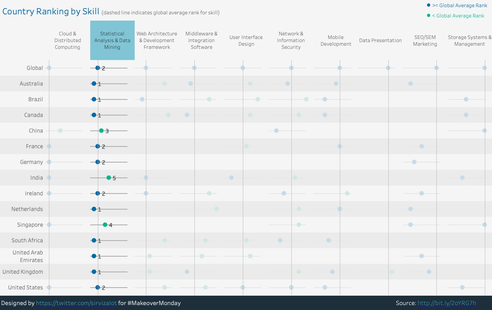
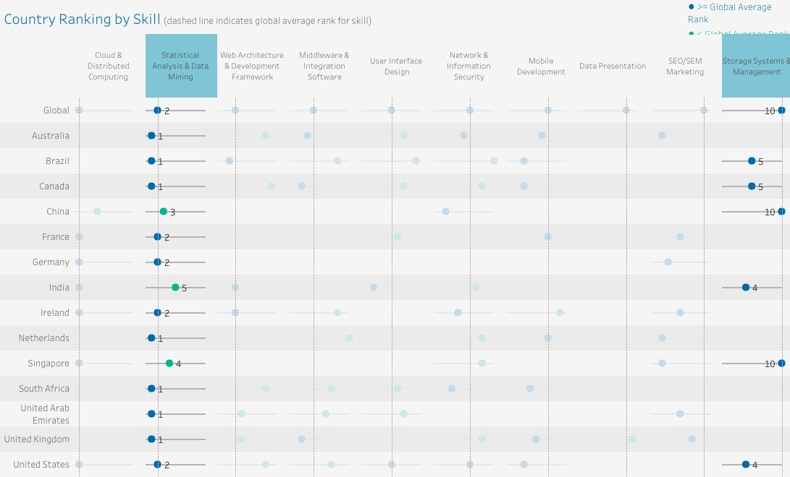
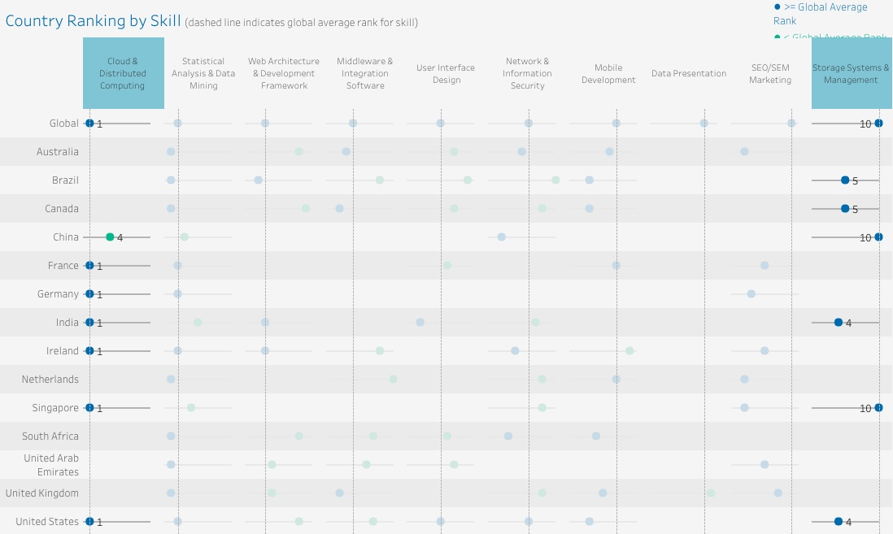

# band project 1

> 评审记录
1. 评审大大好，这是我商业分析项目1的报告，涉及3个内容，在以下三节完成，辛苦大大！
2. 感谢评审老师反馈，已经作出修改，请审阅。

# / 观察1：数据分析技能是热门技能

通过解读视觉化的数据，发现数据分析相关技能（统计分析与数据挖掘：Statistic Analysis & Data Mining）是最热门的技能，也是唯一一个14个国家都重视的技能。投资学习数据分析非法划算。

## // 分析过程

- 接触 Linkedin 这份报告以后，首先注意到的是10种技能的排序是按照 Global 的综合排序从第1名排序到第10名的。
- 依次点击每个技能，发现在14个国家的排名技能不尽相同。但是数据分析技能是唯一一个全部都包含的技能。
- 技能的全球排名为第2。中国、印度、新加坡低于这个排名，Australia、Brazil、Canada、Netherland、South Africa、United Arab Emirates、United Kingdom高于这个排名。

## // 静态图像

数据分析作为唯一一个所有国家都有的技能需求，我觉得还是得好好学。

# / 观察2：对比统计分析技能，存储技能前景堪忧

接下来在对比一下我自己掌握的存储技能的需求情况，发现前景堪忧，需要尽快学习新技能，提高竞争力。

## // 分析过程

- 本人从事存储管理工作，但作为一个比较老的技能，逐渐在被云技术所替代。所以开始学习数据分析相关技能。在 Linkedin 的技能图谱中（前10），正好发现了这两种，做一下对比分析。
- 可以看到存储技能的发展不太好。官方排名第10名。高于官方排名的有Brazil、Canada、India、United States。
- 其中的 United States 排名靠前的原因是存储系统厂商的重地，涉及到产品的生产和研发。
- 其他国家除了 Canada 以外都是发展中国家，说明在数据中心建设中，依赖于集中存储架构的投入还占比较大的比例，所以这个技能有一定市场。

## // 静态图像

# / 观察3：美国、中国和印度在云计算和存储方面持续重视

存储技术的饭碗其实是被云计算给抢走了，那么对于这两个排名第1和排名第10的系统，我们做一下比较。

## // 分析过程

- 同时选中两列数据，发现云计算有8个国家包含，存储有7个国家包含。
- 可以发现 Brazil 和 Canada 重视存储技能，可完全不注重云计算，在未来的发展中可能会有短板。
- 美国作为两种技术的领导者，在两个技能都很靠前。
- 而中国在云计算的重视程度虽然有但还排名比较靠后，需要一段时间追赶。

## // 静态图像

# / 总结

## // 展示中的亮点

### 引入颜色作为一个数据类型的展示：

每个技能点分为蓝色和绿色，蓝色表示比 Global 排名高，绿色表明比 Global 。这种用颜色表示关系的方式非常方便，可以多展现一个数据纬度。尤其是分为两类的颜色区分时。

### 每列圆点位置具有象征意义：

没列的圆点位置为从1-10的排名位置，并且在 Global 位置有一竖线贯穿整列，利于观众迅速获得排名的概念，非常形象。

## // 建议
对于这个数据展示的几点改善建议：
- 增加排名变化内容，比如说最后一张图，想看到和去年比，名次有什么变化。只是初步的想法，需要考虑是否可以明确展示到一起（比如用箭头Tableau是否支持，表达信息是否清晰等）
- 可以增加一些按钮，做些预制的选择（比如发展中国家 vs 发达国家）

